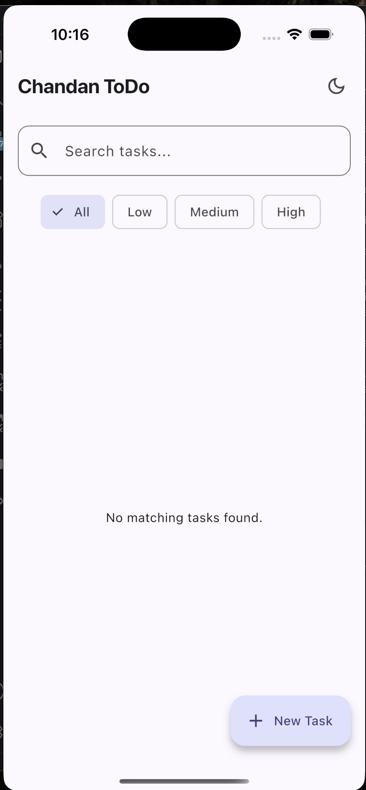
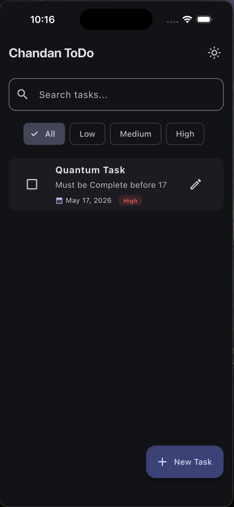
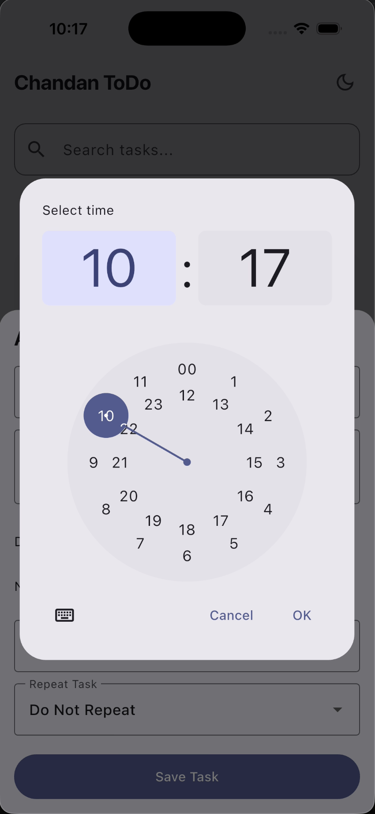
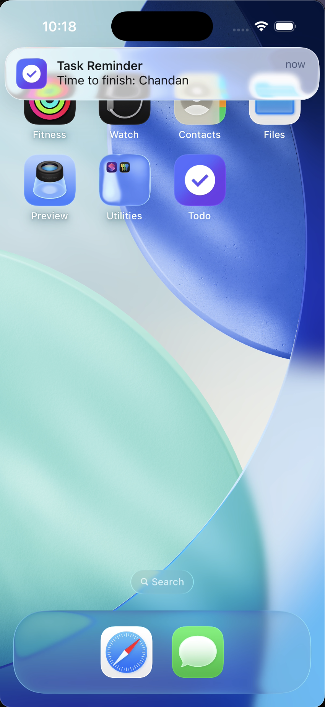
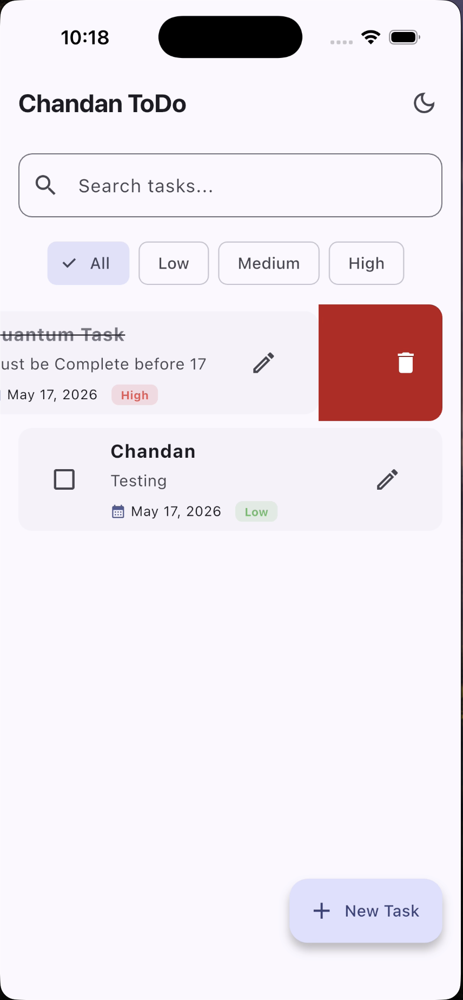

# Clean Architecture Flutter ToDo Application
A production-grade, highly optimized Material 3 ToDo application built using pure, enterprise-level Clean Architecture principles. This project is engineered with a strict separation of concerns, ensuring high decoupling, maximum testability, and a robust offline-first synchronization flow.

## 🎨 Architecture & Structural Blueprint
The codebase strictly follows Uncle Bob's Clean Architecture guidelines, dividing responsibility into three distinct, insulated layers (Presentation, Domain, and Data). This structural decoupling guarantees that business logic remains completely independent of databases, external UI components, or device-level frameworks.

``` text
lib/
├── core/                # App-wide engines, global configurations, and platform bridges
│   ├── di/              # Service Locator configuration (GetIt Dependency Injection)
│   ├── services/        # Hardware communication bridges (Local Notifications Engine)
│   └── utils/           # Shared stateless helper algorithms (Recurrence date arithmetic)
├── data/                # Infrastructure, external data access, and storage drivers
│   ├── models/          # Hive Data Transfer Objects (DTOs) with auto-generated type adapters
│   └── repositories/    # Implementation of domain repository abstract contracts
├── domain/              # Core Business Rules (Pure Dart layer - Zero Framework Dependencies)
│   ├── entities/        # Pure immutable business models (The structural truth of the app)
│   ├── repositories/    # Abstract repository contract boundaries
│   └── usecases/        # Single-responsibility application commands (Command Pattern)
└── presentation/        # Reactive User Interface & UX Frame
    ├── bloc/            # Business Logic Components separating UI from Domain controllers
    ├── pages/           # High-level full-screen structural canvas views
    └── widgets/         # Atomic, reusable presentation components and cards
```

## 📱 Feature & Performance Capabilities

**Full CRUD Persistence:** Flawless tracking, modification, and swipe-to-delete task workflows backed by sub-millisecond local binary storage engine cycles.

**Granular Task Metadata:** Advanced entity configurations mapping descriptive text, precise deadline dates, and distinct priority weight classifications.

**Reactive Filtering Hub:** Lightning-fast search indexing and filter chip matrix switches managed reactively via client-side state processing.

**Smart Recurrence Engine:** Built-in calculation layers automatically executing forward-rolling date projections for Daily, Alternate, Weekly, and Monthly intervals upon task completion.

**Custom Notification Windows:** Fully integrated local alarm bridges letting users customize precision target alerts linked directly to target task deadlines.

**Dual-Engine Theme Controller:** A customized interactive Material 3 manual light/dark interface toggle utilizing unified color schemes with full real-time system fallbacks.

**Isolated Testing Infrastructure:** Complete programmatic validation engine leveraging mocked data injection streams to assert state-flow safety margins across extreme conditions.

## 🛠️ Enterprise Technology Stack

**State Management (flutter_bloc):** Applied to enforce explicit, unidirectional data flows. This ensures predictable state transitions and eliminates structural race-conditions during 
dense interface refreshes.

**Dependency Injection (get_it):** Leveraged as an enterprise service locator pattern to manage memory consumption through lazy singletons and eliminate tight object-to-object couplings.

**Local Persistence Engine (hive & hive_flutter):** Implemented for high-speed local data persistence. It performs raw binary serialization on local disk clusters without utilizing heavy, slow SQL query parsers.

**Native Device Bridges (flutter_local_notifications):** Directly hooks into underlying Android AlarmManagers and iOS Darwin notifications to ensure accurate alarm deliveries in low-power idle states.

**Quality Assurance Framework (bloc_test & mocktail):** Utilized to execute behavioral assertions on business logic code in complete isolation from external framework factors.

## 🚀 Step-by-Step Local Deployment Guide
Follow these exact operational steps to configure and run the production environment locally on your terminal:

**1. Environment Clone**
Clone the public target source files and switch into the project directory root:

*git clone https://github.com/ChandanGupta31/chandan_todo_app.git* <br>
*cd todo_app*

**2. Dependency Resolution**
Fetch all verified ecosystem and framework dependencies listed in the manifest file:

*flutter pub get*

**3. Execution of Code Generators**
To map out the type adapters required for localized database serialization, compile the source files using the build runner:

*flutter pub run build_runner build --delete-conflicting-outputs*

**4. Launching the App**
Ensure a target active device, hardware simulator, or emulator is recognized by your machine environment, then compile the native assets:

*flutter run*

**5. Running Automated Unit Tests**
To verify the entire business logic and state architecture against edge-case evaluation metrics, execute the testing suite:

*flutter test test/task_bloc_test.dart*

## 📸 Application Gallery
Here is a look at the production build in action:

<p align="center">
  
  &nbsp;&nbsp;&nbsp;
  
  &nbsp;&nbsp;&nbsp;
  
</p>

<p align="center">
  
  &nbsp;&nbsp;&nbsp;
  
</p>


**Demo Video**

https://github.com/user-attachments/assets/a7eec241-5db4-45c4-a8e2-fbe5d9fa1a37

